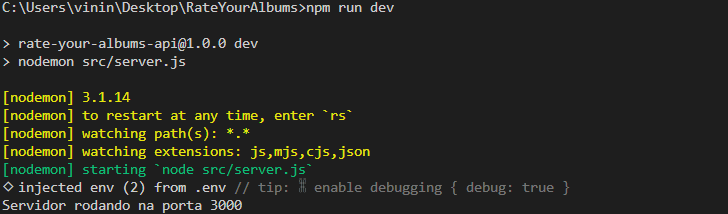
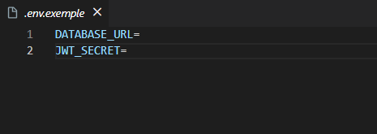
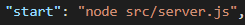
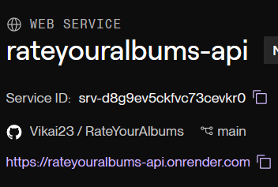
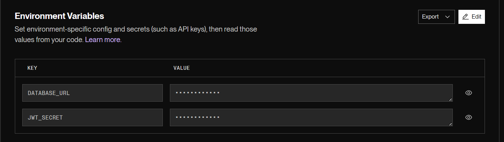
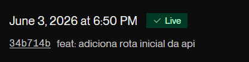
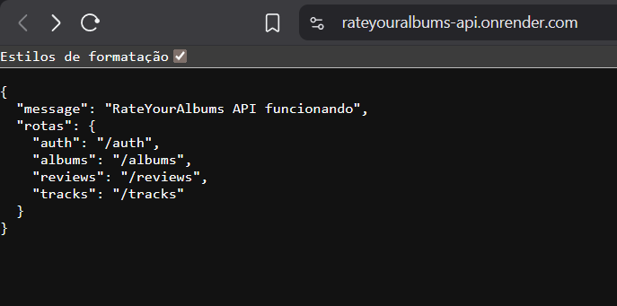
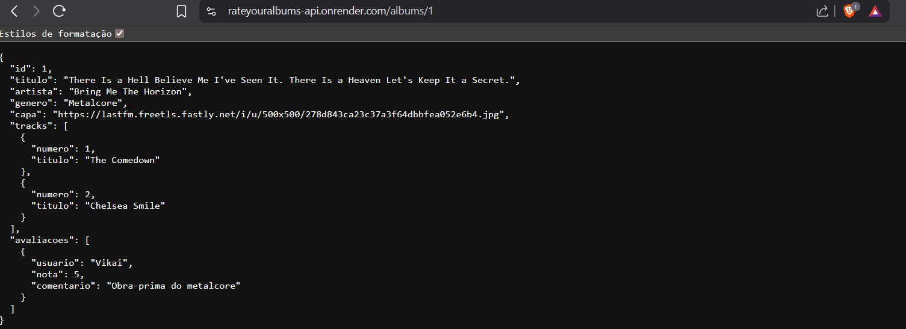

# ADO 2 - Hospedagem da API REST Node.js

**Projeto:** RateYourAlbums

**Aluno:** Vinícius Sousa

**Disciplina:** Aplicação Web em Camadas

---

## 1. Como a API rodava localmente

Antes de hospedar a API, ela rodava no meu próprio computador.

Para iniciar o servidor localmente eu usava o comando:

```bash
npm run dev
```

Esse comando usa o Nodemon para rodar o arquivo `src/server.js`.

Terminal com a API rodando localmente:



No `.env` local, a API usava as variáveis `DATABASE_URL` e `JWT_SECRET`.

O `.env` real não foi enviado para o GitHub pois ele tem dados sensíveis, tipo senha do banco e chave JWT. Por isso deixei só o `.env.example`.

Print do `.env.example`:



No `package.json`, deixei também o script `start`, pois ele é usado para rodar a API fora do ambiente local.

Print do `package.json` mostrando o script `start`:



---

## 2. Opções de hospedagem pesquisadas

### Render

O Render permite hospedar aplicações Node.js, então ele servia para minha API feita com Express.

Escolhi o Render porque eu já tinha usado um pouco ele no projeto de PI, então eu já estava mais familiarizado com a plataforma. Como eu já tinha mexido nele antes, achei que seria mais tranquilo do que tentar fazer tudo em uma ferramenta nova.

Também achei mais simples pois ele conecta com o GitHub e quando eu mando alguma atualização para o repositório ele consegue fazer o deploy de novo.

### Railway

O Railway também permite hospedar API Node.js e banco de dados. Eu até pensei em usar ele pois vejo bastante gente usando, mas acabei não escolhendo porque eu estava mais acostumado com o Render.

Como a ideia era colocar minha API no ar sem mudar muita coisa, preferi ir no que eu já conhecia melhor.

### Koyeb

O Koyeb também consegue hospedar aplicações web e API Node.js. Pelo que pesquisei ele também serviria para esse trabalho.

Mesmo assim eu descartei porque eu não tinha tanta familiaridade com ele. Como eu já tinha usado Render antes, achei melhor não complicar e usar uma plataforma que eu já entendia um pouco mais.

---

## 3. Deploy da API no Render

A hospedagem escolhida foi o Render.

Escolhi ele principalmente porque eu já tinha usado no meu projeto de PI, então eu já tinha uma noção melhor de onde mexer. Como a API precisava ir pro ar e se conectar com o banco da Aiven, achei melhor usar uma plataforma que eu já conhecia um pouco.

Primeiro entrei no Render e criei um novo Web Service. Depois conectei o Render com meu GitHub e selecionei o repositório do projeto RateYourAlbums.

Render conectado ao repositório:



Na configuração do deploy, usei os comandos do projeto.

O build command ficou assim:

```bash
npm install && npx prisma generate
```

O start command ficou assim:

```bash
npm start
```

O Render sabe como iniciar a API porque no `package.json` existe esse script:

```json
"start": "node src/server.js"
```

---

## 4. Variáveis de ambiente no Render

No Render, configurei as variáveis de ambiente que minha API precisava para funcionar.

As principais foram:

```env
DATABASE_URL=*****
JWT_SECRET=*****
```

Variáveis de ambiente no Render, com os valores escondidos:



A `DATABASE_URL` usada no Render foi a mesma URL do banco hospedado na Aiven, que foi feito na ADO 1.

O `JWT_SECRET` foi usado para a parte de login e token da API.

No computador essas informações ficam no `.env`, mas no Render eu tive que colocar elas direto no painel da plataforma, pois o `.env` real não vai para o GitHub.

---

## 5. Deploy concluído

Depois de configurar o repositório, os comandos e as variáveis de ambiente, iniciei o deploy.

Deploy concluído no Render:



Depois do deploy, o Render gerou uma URL pública para acessar a API.

URL pública funcionando:



---

## 6. Requisição funcionando em produção

Para testar se a API realmente estava funcionando em produção, usei a URL pública gerada pelo Render.

Testei a rota:

```http
GET /albums/1
```

A URL ficou assim:

```txt
https://rateyouralbums-api.onrender.com/albums/1
```

Requisição funcionando em produção:



Essa rota retornou um álbum cadastrado, junto com as faixas e a avaliação. Isso mostrou que a API hospedada estava funcionando e também estava conectando no banco remoto da Aiven.

---

## 7. Como a API se conecta ao banco hospedado

A API hospedada no Render usa a variável `DATABASE_URL` para encontrar o banco.

No meu caso, essa `DATABASE_URL` é a URL do banco MySQL hospedado na Aiven, que foi criado na ADO 1.

Então quando a API está rodando no Render, ela não usa o banco do meu computador. Ela usa o banco remoto da Aiven.

No ambiente local eu colocava isso no arquivo `.env`. No Render eu coloquei direto na parte de variáveis de ambiente da plataforma.

Isso é importante porque o `.env` tem senha e chave secreta, então ele não pode ir para o GitHub.

---

## 8. O que aconteceria se o DATABASE_URL estivesse errado

Se o `DATABASE_URL` estivesse errado, a API não conseguiria falar com o banco.

Ela até poderia abrir, mas quando tentasse buscar ou salvar alguma coisa, como em `/albums`, daria erro porque o Prisma não conseguiria conectar no MySQL da Aiven.

Então essa variável precisa estar certa, pois é ela que liga a API com o banco remoto.

---

## 9. Erro encontrado e como resolvi

Durante o processo, tive um problema quando abri a URL principal da API no Render.

Apareceu a mensagem:

```txt
Cannot GET /
```

Na hora eu achei que tinha quebrado tudo, mas depois percebi que não era isso. A API estava no ar, só que eu não tinha criado uma rota para `/`.

As rotas `/albums`, `/reviews`, `/tracks` e `/auth` já existiam, mas a rota principal ainda não.

Para resolver, adicionei uma rota simples no `server.js`:

```js
app.get('/', (req, res) => {
  return res.status(200).json({
    message: 'RateYourAlbums API funcionando',
    rotas: {
      auth: '/auth',
      albums: '/albums',
      reviews: '/reviews',
      tracks: '/tracks'
    }
  });
});
```

Depois disso, fiz commit, dei push no GitHub e o Render atualizou a API automaticamente.

---

## 10. Deploy automático pelo GitHub

O Render ficou conectado ao repositório do GitHub.

Então quando eu faço alguma alteração no projeto e dou `git push`, o Render percebe que teve mudança e faz um novo deploy.

Foi isso que aconteceu quando eu adicionei a rota `/`. Eu alterei o projeto, mandei para o GitHub e depois o Render atualizou a API sozinho.
